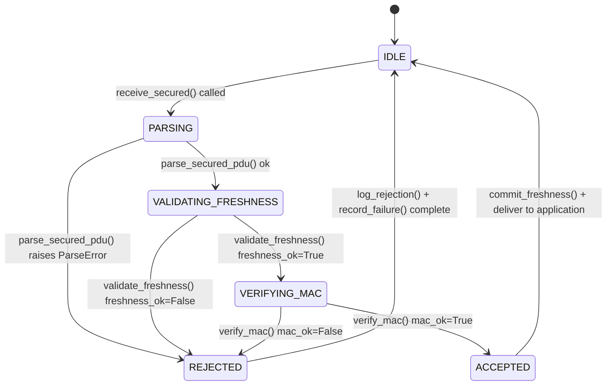
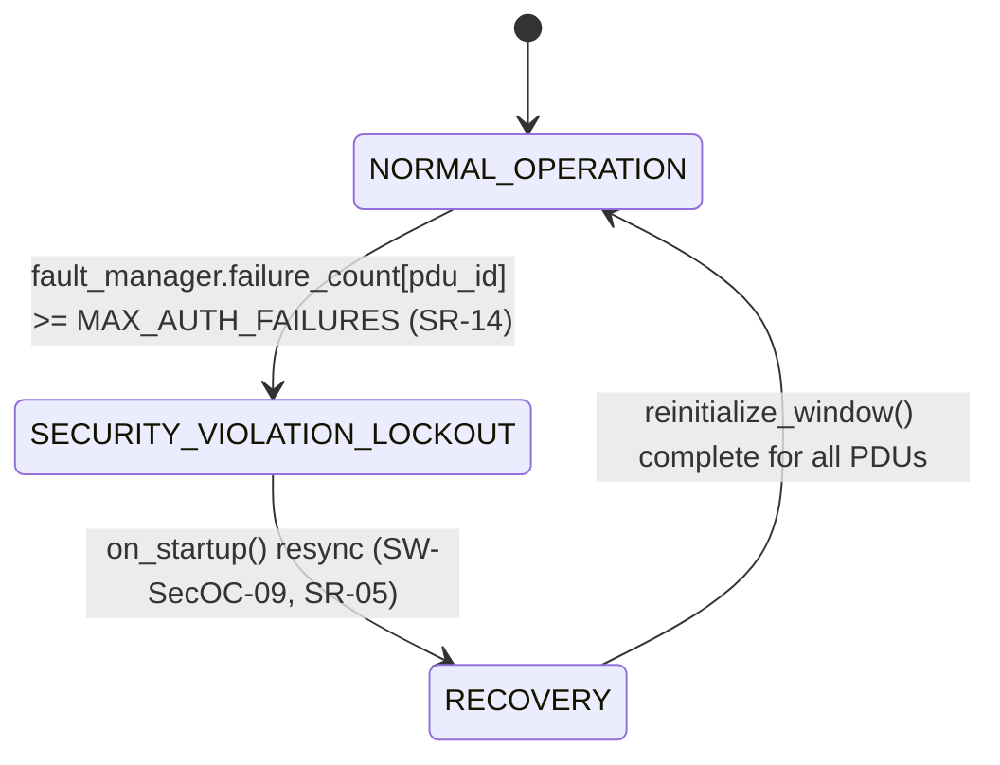

# ASPICE SWE.3 — Software Detailed Design

**Document ID:** ASPICE-SWE3-SecOC-001
**Version:** 1.0
**Date:** 2026-06-11
**Author:** TBD
**ASPICE Process:** SWE.3 (Software Detailed Design and Unit Construction)
**Project:** SecOC — AUTOSAR Classic Secure Onboard Communication Simulation, Phase 1

| Version | Date | Author | Change |
|---|---|---|---|
| 1.0 | 2026-06-11 | TBD | Initial release — Phase 1, Step 7 (post-qualification) |

---

## 1. Purpose & Scope

This document is the SWE.3 evidence record. It summarizes the Low-Level Design (LLD)
documents in `design/lld/` (one per `sim/` module, 32 files total per
`requirements/sim.txt`), the key state machines, and the key algorithms governing
SecOC's transmit/receive paths and fault escalation.

---

## 2. LLD Summary

| LLD Document | Module | Implements (SWR/SR) | VTC(s) |
|---|---|---|---|
| `LLD_secoc.md` | `secoc.py` | SW-SecOC-01..09, SR-11 | VTC-SR-01, 03-07, 11 |
| `LLD_pdu_manager.md` | `pdu_manager.py` | SW-SecOC-01, SW-SecOC-02 | VTC-SR-01, 03, 04, 06, 07, 11 |
| `LLD_authenticator.md` | `authenticator.py` | SW-SecOC-04, SW-SecOC-06, SW-SecOC-08 | VTC-SR-02, 06, 07, 12 |
| `LLD_freshness_manager.md` | `freshness_manager.py` | SW-SecOC-03, SW-SecOC-05, SW-SecOC-09 | VTC-SR-03, 04, 05 |
| `LLD_security_profile.md` | `security_profile.py` | SW-SecOC-07, SR-11, SR-20 | VTC-SR-10, 11, 17, 20 |
| `LLD_crypto_interface.md` | `crypto_interface.py` | SW-SecOC-04 (abstract API) | VTC-SR-10 |
| `LLD_hmac_crypto.md` | `hmac_crypto.py` | SW-SecOC-04 | VTC-SR-06, 07 |
| `LLD_key_manager.md` | `key_manager.py` | SW-SecOC-10 | VTC-SR-08, 09 |
| `LLD_key_storage.md` | `key_storage.py` | SW-SecOC-10 | VTC-SR-08, 09 |
| `LLD_ecu_base.md`, `LLD_sender_ecu.md`, `LLD_receiver_ecu.md` | `ecu_base.py`, `sender_ecu.py`, `receiver_ecu.py` | SW-SecOC-01, SW-SecOC-02 | VTC-SR-01, 03-07 |
| `LLD_pdu_router.md`, `LLD_signal_packager.md` | `pdu_router.py`, `signal_packager.py` | SW-SecOC-01, SW-SecOC-02 | VTC-SR-01, 16 |
| `LLD_can_interface.md`, `LLD_can_fd_interface.md` | `can_interface.py`, `can_fd_interface.py` | SR-16 | VTC-SR-16 |
| `LLD_can_bus.md`, `LLD_message_frame.md`, `LLD_bus_scheduler.md` | `can_bus.py`, `message_frame.py`, `bus_scheduler.py` | SR-15 (transport sim) | VTC-SR-15, 16 |
| `LLD_event_logger.md`, `LLD_security_events.md` | `event_logger.py`, `security_events.py` | SW-SecOC-06, SR-13 | VTC-SR-13 |
| `LLD_fault_manager.md`, `LLD_security_policy_engine.md` | `fault_manager.py`, `security_policy_engine.py` | SR-14 | VTC-SR-14 |
| `LLD_secure_boot.md`, `LLD_integrity_checker.md` | `secure_boot.py`, `integrity_checker.py` | SR-19 | VTC-SR-19 |
| `LLD_replay_attack.md`, `LLD_mitm_attack.md`, `LLD_fuzzing_engine.md`, `LLD_message_injector.md` | attack/test harness | test support for SR-01..04 | VTC-SR-01..04 |
| `LLD_scenario_runner.md`, `LLD_test_vectors.md`, `LLD_performance_profiler.md` | CI orchestration, MAC vectors, profiler | SW-SecOC-08, SR-12, SR-15, SR-18 | VTC-SR-06, 12, 15, 18 |
| `LLD_logger.md`, `LLD_time_utils.md`, `LLD_serialization.md` | utilities | (no direct REQ; support) | all (support) |

`design/hld/HLD_SecOC.md` §3 is the authoritative module inventory; this table maps
each LLD to its requirement and test coverage per `requirements/traceability_matrix.md`
§8.

---

## 3. State Machines

### 3.1 SecOC per-PDU receive-path state machine

Source: `design/lld/LLD_secoc.md` §3. Tracks one `receive_secured()` call:



This is the basis for the 8-step animated flow in `dashboard/index.html` Panel 2
(`tx-fresh`, `tx-mac`, `tx-build`, `bus`, `rx-parse`, `rx-fresh`, `rx-mac`, `rx-commit`).

### 3.2 ECU-wide escalation state machine

Source: `design/lld/LLD_secoc.md` §3 / `sim/ecu_state.py`:



`EcuStateValue` additionally defines `BOOT_BLOCKED`, entered if
`secure_boot.verify_boot_integrity()` fails at startup (SR-19, VTC-SR-19) — see
`design/lld/LLD_secure_boot.md`.

### 3.3 CSM job state machine

`csm.py` (reused/extended): `IDLE → ACTIVE → FINISHED | FAILED`, dispatching MAC jobs
through `cryif.py` to `hsm.py`. See `design/lld/LLD_hmac_crypto.md` and
`design/diagrams/seq_auth_flow_SecOC.md`.

---

## 4. Key Algorithms

### 4.1 `transmit_secured(pdu_id, authentic_pdu)` — Tx orchestration

(SW-SecOC-01, SW-SecOC-03, SW-SecOC-04, SW-SecOC-08, SR-11)

```
profile = security_profile.get_profile(pdu_id)
freshness_value = freshness_manager.get_freshness(pdu_id)        # last_valid + 1
truncated_mac = authenticator.generate_mac(pdu_id, authentic_pdu, freshness_value)
secured_pdu = pdu_manager.build_secured_pdu(
    authentic_pdu, freshness_value, truncated_mac, profile)
return secured_pdu   # authentic_pdu || freshness || mac
```

Note: `get_freshness()` does **not** commit the counter — it is committed only on a
successful `receive_secured()` for the same PDU (see §4.2 step 5). Repeated
`transmit_secured()` calls without an intervening successful receive therefore return
the same `freshness_value`.

### 4.2 `receive_secured(pdu_id, secured_pdu)` — Rx orchestration

(SW-SecOC-02, SW-SecOC-03, SW-SecOC-04, SW-SecOC-05, SW-SecOC-06, SR-01, SR-13)

```
profile = security_profile.get_profile(pdu_id)
try:
    authentic_pdu, truncated_freshness, mac = pdu_manager.parse_secured_pdu(secured_pdu, profile)
except ParseError:
    return _reject(pdu_id, "MALFORMED_STRUCTURE")

freshness_ok, candidate = freshness_manager.validate_freshness(pdu_id, truncated_freshness)
if not freshness_ok:
    return _reject(pdu_id, "FRESHNESS_OUT_OF_WINDOW")

if not authenticator.verify_mac(pdu_id, authentic_pdu, candidate, mac):
    return _reject(pdu_id, "MAC_MISMATCH")

freshness_manager.commit_freshness(pdu_id, candidate)
can_bus.publish(pdu_id, secured_pdu)
return authentic_pdu
```

### 4.3 Freshness validation (window-based, modulus arithmetic)

(SW-SecOC-03, SW-SecOC-05, SR-04) — `freshness_manager.validate_freshness()`:

```
MODULUS = 1 << (freshness_length * 8)        # 65536 for freshness_length=2
last_valid = nvm.read(f"freshness_{pdu_id}") or 0
base = (last_valid // MODULUS) * MODULUS
candidate = base + truncated_freshness
if candidate <= last_valid:
    candidate += MODULUS
delta = candidate - last_valid
freshness_ok = 0 < delta <= WINDOW_SIZE      # WINDOW_SIZE = 16
return freshness_ok, candidate
```

This handles wraparound of the truncated 2-byte freshness field while enforcing a
sliding acceptance window (VTC-SR-03, VTC-SR-04). It is mirrored exactly in
`dashboard/index.html`'s JS `receiveSecuredPdu()`.

### 4.4 Rejection classification and fault escalation

(SW-SecOC-06, SR-13, SR-14) — `_reject(pdu_id, reason)`:

```
event_logger.log_rejection(pdu_id, reason)
  -> security_events.classify(reason)
       # MAC_MISMATCH | FRESHNESS_OUT_OF_WINDOW | MALFORMED_STRUCTURE
       #   -> (Severity.CRITICAL, "SECOC_AUTH_FAIL")
  -> dem.log(severity, "SECOC_AUTH_FAIL", swr_ref="SR-13", data={"pdu_id": pdu_id, "reason": reason})

fault_manager.record_failure(pdu_id, FailureCategory.AUTH)
security_policy_engine.evaluate(fault_manager.failure_count(pdu_id, AUTH))
  if failure_count >= MAX_AUTH_FAILURES and not _locked_out:
      ecu_state.transition(EcuStateValue.SECURITY_VIOLATION_LOCKOUT)
      dem.log(Severity.CRITICAL, "SAFE_STATE_ENTERED", swr_ref="SR-14")
      _locked_out = True   # idempotent — logged at most once
return None
```

### 4.5 Boot-time integrity check

(SR-19) — `secure_boot.verify_boot_integrity()`, `design/lld/LLD_secure_boot.md`:

```
snapshot = _CURRENT_SNAPSHOT   # "SECOC_FIRMWARE_SNAPSHOT_V1::code+config+keymeta"
for component, nvm_key in (("code", "boot_golden_hash_code"),
                            ("config", "boot_golden_hash_config"),
                            ("keys", "boot_golden_hash_keys")):
    golden = nvm.read(nvm_key)
    actual = integrity_checker.compute_hash(snapshot)
    if actual != golden:
        ecu_state.transition(EcuStateValue.BOOT_BLOCKED)
        dem.log(Severity.CRITICAL, "BOOT_INTEGRITY_FAIL", swr_ref="SR-19",
                data={"component": component})
        return {"boot_integrity_ok": False, "failed_component": component}
return {"boot_integrity_ok": True, "failed_component": None}
```

---

## 5. Data Structures

| Structure | Definition |
|---|---|
| Secured I-PDU | `authentic_pdu (variable) \|\| freshness (2 bytes, big-endian) \|\| authenticator (8 bytes)` |
| `SecurityProfileEntry` | `{algorithm: str, key_id: str, freshness_length: int, authenticator_length: int, profile_version: str}` (no encryption/confidentiality fields — SR-20) |
| DEM event | `{event_id: str, severity: Severity, description: str, swr_ref: str, timestamp: float, data: dict}` |
| Key metadata | `{pdu_id: str, key_id: str, version: int, lifecycle_state: KeyLifecycleState}` (no raw key bytes) |
| `EcuStateValue` | Enum: `NORMAL_OPERATION`, `SECURITY_VIOLATION_LOCKOUT`, `BOOT_BLOCKED` |
| `ForgeMode` | Enum: `MALFORMED_STRUCTURE`, `INVALID_MAC`, `WRONG_FRESHNESS` |

---

## 6. Error Codes / Rejection Reasons

| Reason | DEM Severity | DEM Event ID | SWR/SR Ref |
|---|---|---|---|
| `MALFORMED_STRUCTURE` | CRITICAL | `SECOC_AUTH_FAIL` | SR-13 |
| `FRESHNESS_OUT_OF_WINDOW` | CRITICAL | `SECOC_AUTH_FAIL` | SR-13, SR-04 |
| `MAC_MISMATCH` | CRITICAL | `SECOC_AUTH_FAIL` | SR-13, SR-07 |
| (5th consecutive AUTH failure) | CRITICAL | `SAFE_STATE_ENTERED` | SR-14 |
| Boot golden-hash mismatch | CRITICAL | `BOOT_INTEGRITY_FAIL` | SR-19 |

---

## 7. Unit Test Mapping

Per-module unit test mapping (LLD §"Unit Test Mapping" sections) is consolidated in
`requirements/traceability_matrix.md` §8 (Implementation Coverage by Module) and
detailed per-VTC in `docs/ASPICE_SWE4_UnitVerification.md`.
